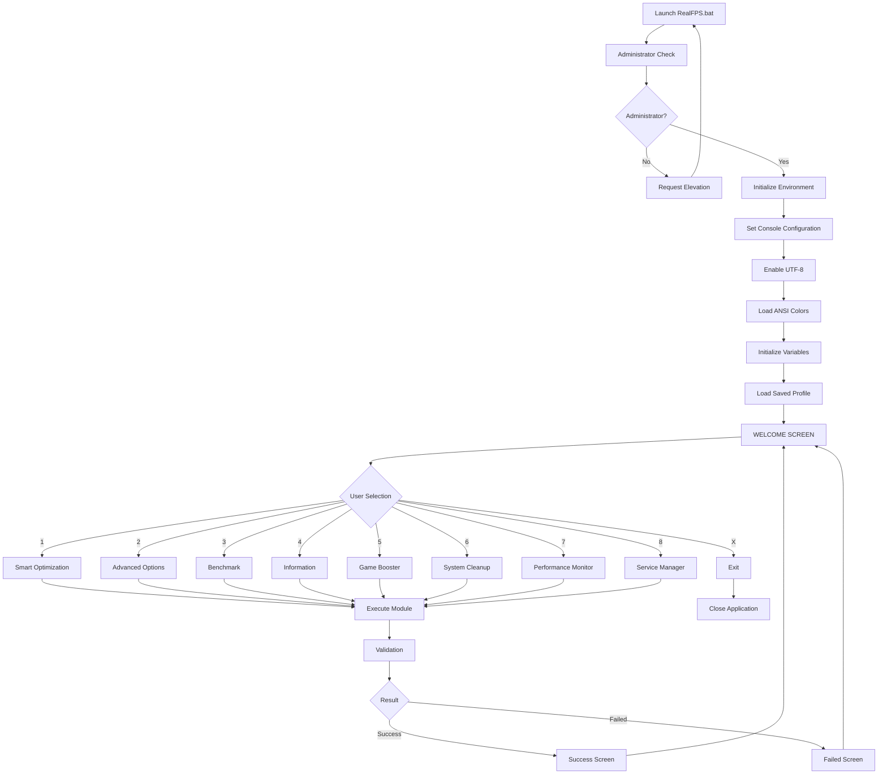

# RealFPS Execution Flow

> Complete execution pipeline of REALFPSv2_3.bat.

## Overview

RealFPS is built as a Batch State Machine.

Unlike traditional applications with a linear execution flow, RealFPS uses:

- CMD labels
- GOTO routing
- State variables
- Modular functions

Each screen and feature works as an independent state.

---

# Complete Runtime Flow



---

# Runtime States

## State 1 - Initialization

Responsible for:

- Console setup
- Color engine
- Variables
- Environment detection
- Profile loading


## State 2 - User Interface

Main navigation:

```
WELCOME
    |
    +-- Smart Optimization
    |
    +-- Advanced Options
    |
    +-- Benchmark
    |
    +-- Information
    |
    +-- Game Booster
    |
    +-- Cleanup
    |
    +-- Performance Stats
    |
    +-- Service Manager
```


## State 3 - Module Execution

Every module follows:

```
INPUT
 |
VALIDATION
 |
EXECUTION
 |
RESULT CHECK
 |
RETURN
```


## State 4 - Result Handling

All actions return:

### Success

```
Operation Completed
Changes Applied
```

### Failed

```
Operation Failed
No Changes Applied
```


## State 5 - Exit

When user selects:

```
X - Exit
```

RealFPS:

- closes running states
- terminates CMD session
- returns control to Windows
