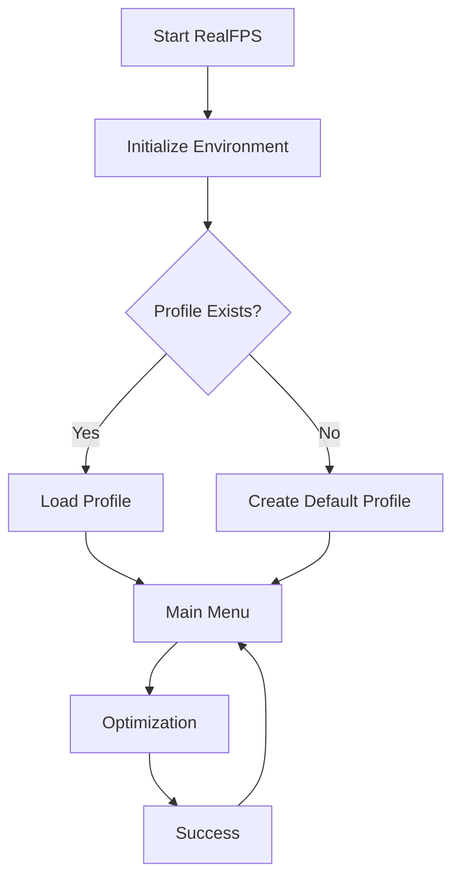

# RealFPS Lifecycle

> Complete execution flow of RealFPS Windows Gaming Optimizer.

**Version:** REALFPSv2_3  
**Type:** Windows Batch TUI Application  
**Platform:** Windows 10 / Windows 11

---

## Overview

RealFPS is a Windows Gaming Optimizer built with Batch Script.

The application follows a state-machine architecture using CMD labels and routing logic.

The lifecycle consists of:

1. Initialization
2. Welcome Interface
3. User Routing
4. Task Execution
5. Result Handling
6. Return Loop / Exit

## Mermaid Test

