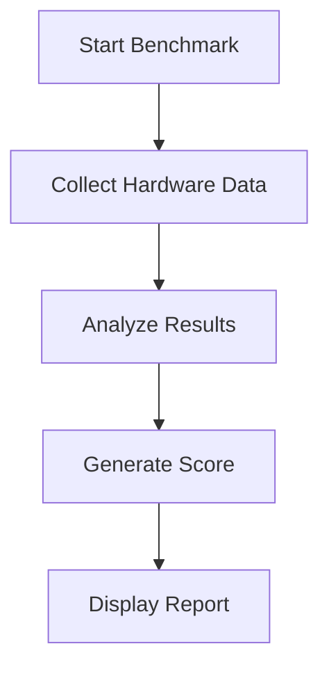

# Benchmark

> Evaluate system performance.

## Features

- CPU Information
- GPU Information
- RAM Information
- Hardware Summary
- Performance Rating

---

## Workflow

```mermaid
flowchart TD

A[Start Benchmark]

A --> B[Collect Hardware Data]

B --> C[Analyze Results]

C --> D[Generate Score]

D --> E[Display Report]
```
