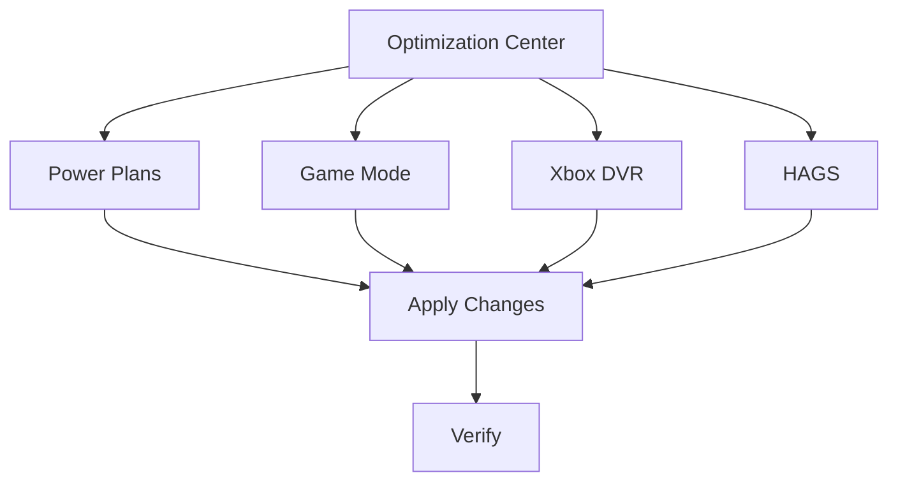

# Optimization Center

> Manual optimization controls.

## Features

- Power Plans
- Game Mode
- Xbox DVR
- Hardware Accelerated GPU Scheduling (HAGS)

---

## Workflow

```mermaid
flowchart TD

A[Optimization Center]

A --> B[Power Plans]

A --> C[Game Mode]

A --> D[Xbox DVR]

A --> E[HAGS]

B --> F[Apply Changes]

C --> F

D --> F

E --> F

F --> G[Verify]
```
