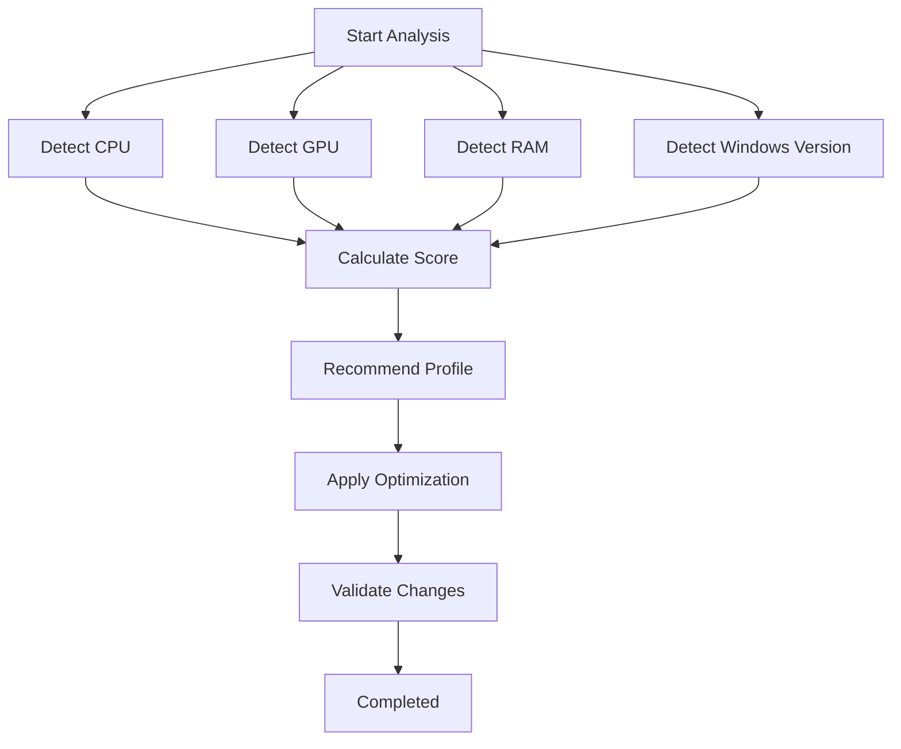

# Smart Optimization

> One-click automatic optimization for gaming.

## Purpose

Smart Optimization is designed for users who want the easiest way to improve system performance.

The module automatically:

- Detects hardware
- Calculates a performance score
- Recommends the most suitable profile
- Applies optimizations
- Verifies the result

---

## Workflow

---

## Available Profiles

| Profile | Purpose |
|----------|----------|
| Ultimate Performance | High-end gaming systems |
| High Performance | Gaming desktops |
| Balanced Gaming | Everyday gaming |
| Battery Saver | Laptops |

---

## Technologies Used

- PowerShell
- PowerCFG
- Registry Tweaks
- Hardware Detection
